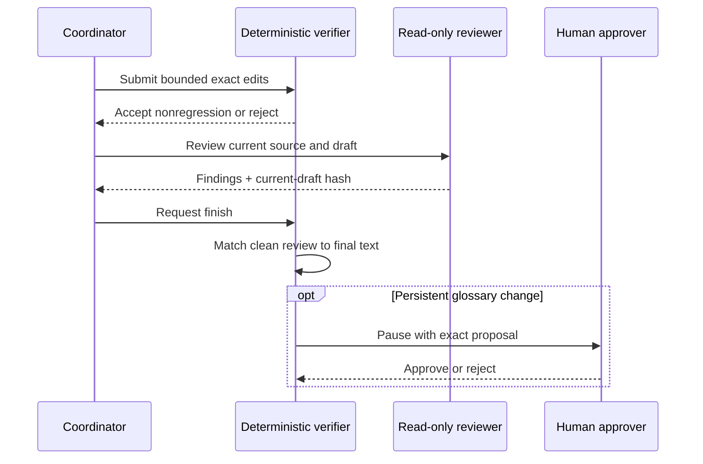

# Agentic Translation Reliability Harness


[](https://github.com/MrEricL/public-tl-harness/actions/workflows/harness-v3.yml)

[](LICENSE)

This is a source-grounded agent harness for repairing translated text. It
combines bounded model edits, deterministic QA, optional Jev semantic checks,
and independent review of the final draft. Every action is recorded for
inspection, approval, and replay.

Long-form translation needs more than readable sentences. Names must stay
consistent across chapters, edits must preserve the source, and interrupted
work must be resumable. The harness connects those checks to a workflow that
delivers TXT and EPUB files.

- **Source-based repair:** terminology and fidelity specialists review the
  draft; the coordinator submits small, exact edits.
- **Jev semantic checks:** typed probabilities flag potential omissions,
  additions, changed roles, and negation for the repair model to inspect.
- **Controlled changes:** QA runs on a working copy, final review is tied to
  the current draft, and persistent glossary changes require approval.
- **Inspectable runs:** saved decisions, reports, and checkpoints support
  pause/resume and cache-only replay.

## Contents

- [Quickstart](#quickstart)
- [How repair works](#how-repair-works)
- [Optional Jev semantic checks](#optional-jev-semantic-checks)
- [Live providers](#live-providers)
- [Examples and evaluation](#examples-and-evaluation)
- [Documentation](#documentation)
- [Development](#development)

## Quickstart

Python 3.11 or newer is required. Install from the repository root:

```bash
python -m venv .venv
source .venv/bin/activate
python -m pip install -U pip
python -m pip install -e '.[dev]'
```

Run the authored, offline demo. It needs no API key or network access:

```bash
python -m agentic_translation harness run \
  --story samples/synthetic_repair_demo/story.yaml \
  --out runs/synthetic-repair
```

The demo repairs a reversed operation sequence and an untranslated technical
term, obtains a fresh review, then pauses for glossary approval. Open
`runs/synthetic-repair/report.html` to inspect the edits and review evidence.
Approve and resume:

```bash
python -m agentic_translation harness resume runs/synthetic-repair \
  --approve --reviewer demo
```

The next chapter reuses the approved term. The completed run includes
`delivery/book.txt` and `delivery/book.epub`. Replay it without another model
call:

```bash
python -m agentic_translation harness replay runs/synthetic-repair \
  --out runs/synthetic-repair-replay
```

Add `--auto-approve` to the initial command for an unattended demo. The offline
fixture uses scripted model decisions to demonstrate the full workflow.

## How repair works

Automatic repair is the default. A coordinator chooses typed actions;
read-only specialists review terminology and fidelity. Python validates each
action, applies edits to a working copy, and checks the result before accepting
it.



| Control | Behavior |
| --- | --- |
| Bounded edits | Exact, single-occurrence replacements in atomic bundles; step and mutation budgets limit the loop. |
| QA gate | A changed draft is accepted only when QA does not regress or introduce a new finding. |
| Final review | Completion requires a nonblocking fidelity review whose SHA-256 matches the current draft. Any edit invalidates the earlier review. |
| Glossary approval | The coordinator proposes persistent terminology changes; a human approves them before the run continues. |
| Resume identity | Source, glossary, provider, tools, instructions, and policies must match the saved session. |
| Replay | Saved provider decisions reproduce the run. Missing or mismatched records fail without falling back to live calls. |

The batch workflow also provides chapter manifests, review queues, glossary
maintenance, and TXT/EPUB packaging. See the [operator guide](USER_GUIDE.md)
for batch commands and the [repair contract](docs/AUTOMATIC_REPAIR.md) for the
editing and review rules.

## Optional Jev semantic checks

Jev adds source-aware judgments to the repair loop. It answers narrow questions
about missing content, unsupported additions, actor/action roles, negation,
and source ambiguity. The repair model receives typed probabilities alongside
the normal QA findings.

Choose five focused questions or eighteen dense questions. Shadow mode records
the signals for inspection; advisory mode shares them with the coordinator.
Reports are tied to the source, draft, and policy so they can be replayed and
checked for freshness after an edit.

Jev is off by default. It supplies signals rather than edits, and final
fidelity review still applies. For configuration, examples, and evaluation
results, see the [Jev guide](docs/JEV_EXTENSION.md).

## Live providers

The same workflow supports OpenAI-compatible providers, including OpenAI and
DeepSeek. Supply credentials through environment variables or `--env-file`:

```bash
python -m agentic_translation harness run \
  --story samples/synthetic_repair_demo/story.yaml \
  --out runs/live-repair \
  --provider-mode live --profile openai --model your-model
```

Live runs save provider decisions for later replay. Provider profiles and
configuration are covered in the [operator guide](USER_GUIDE.md).

## Examples and evaluation

| Explore | Start here |
| --- | --- |
| Repair, approval, and replay in two minutes | [Demo script](DEMO_SCRIPT.md) |
| Tool discovery and two-model terminology decisions | [Harness v3 and terminology replay](USER_GUIDE.md) |
| Semantic repair policy and functional checks | [Automatic repair](docs/AUTOMATIC_REPAIR.md) |
| Jev integration and direct-versus-harness comparisons | [Jev evaluation](docs/JEV_EXTENSION.md#aggregate-evidence) |
| Paired translation benchmark | [Methodology](experiments/mid_corpus_harness_benchmark/README.md), [results](experiments/mid_corpus_harness_benchmark/REPORT.md) |

The demos exercise control flow with authored fixtures. The evaluation reports
separate software checks from live-model results and describe each study's
scope and limitations. A clean model review does not guarantee a correct
translation.

## Documentation

- [Operator guide](USER_GUIDE.md)
- [Automatic repair contract](docs/AUTOMATIC_REPAIR.md)
- [Jev configuration and evaluation](docs/JEV_EXTENSION.md)
- [Session identity and resume guarantees](docs/SESSION_IDENTITY.md)
- [Data notice](DATA_NOTICE.md)
- [Changelog](CHANGELOG.md)

Keep credentials, private text, generated `runs/`, and live response caches out
of commits. The public fixtures are separate from the private evaluation data;
see the [data notice](DATA_NOTICE.md) for that boundary.

## Development

```bash
python -m pip install -e '.[dev]'
python -m pytest -q
```

CI runs the package tests, benchmark checks, and credential-free demos.
