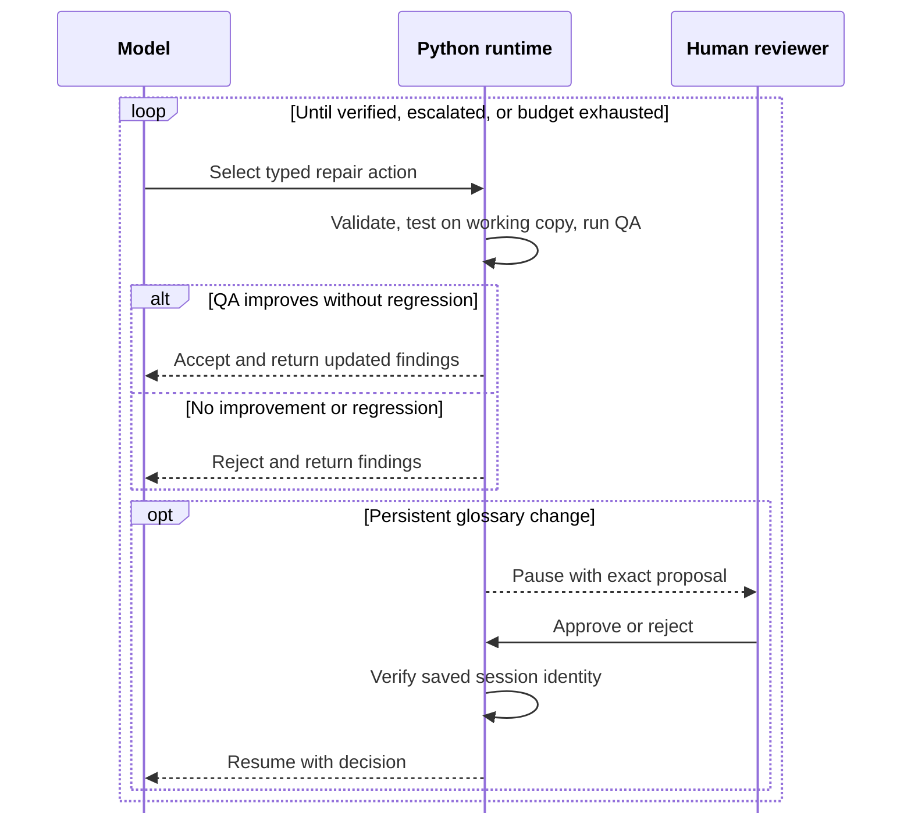

# Agentic Translation Reliability Harness


[](https://github.com/MrEricL/public-tl-harness/actions/workflows/harness-v3.yml)

[](LICENSE)

This is an agent harness for fixing translated text. An LLM translates your
text in a first pass, then this harness goes back over it to clean up the mess:
inconsistent names, lines still in the source language, broken punctuation. It
proposes corrections one at a time and only keeps them when the checks show a
real improvement.

You can run the core demos locally without API credentials. The same runtime
also supports recorded provider replay, pause-and-resume approvals, and batch
output to TXT or EPUB.

**Jump to:** [two-minute walkthrough](#run-the-two-minute-harness-v3-walkthrough)
· [benchmark evidence](#five-chapter-paired-benchmark)
· [harness checklist](#agent-harness-checklist)
· [supplementary replay](#supplementary-terminology-replay)
· [full workflow](#translation-pipeline)
· [documentation](#documentation-map)

- Detect terminology drift, residual source text, punctuation problems, and
  panel-structure errors with deterministic QA.
- Let the model choose from a trusted set of typed tools, exposing more tools
  only when needed.
- Test every proposed edit on a working copy and reject regressions before they
  reach the delivered translation.
- Require human approval before writing a resolved term to the persistent run
  glossary. A resumed run must match the original source, glossary, provider,
  protocol, and tool definitions.



> **Governing rule:** the model proposes; the verifier disposes.

> [!TIP]
> After [installing](#1-install), run `python -m agentic_translation harness golden --runs-dir runs --auto-approve --overwrite` for the complete credential-free walkthrough.

## Why I built this

I've always been a big fan of stories from China, Japan, and Korea (see the
explosion in webtoons and anime), and the biggest bottleneck was the shortage
of translators. There was a huge buffet of stories, but only a trickle made it
into English. Translators had to read, translate, proofread, and publish each
chapter. That was a lot of work for a fickle audience.

In the dark ages (pre-LLM), the stopgap solution was Google Translate. But cultural idioms and phrases were translated far
too literally. Character genders could change constantly because pronouns
do not always map cleanly without context. LLMs jumped readability from 30% to 80%. The issue then became long-term coherence. Web
novels run for hundreds of chapters and context windows means long-term coherence was unsolved.

This is a big issue in sci-fi/fantasy stories, where names are more interpretive and have worldbuilding implications. A technique called **Moon-Shadow Step** might turn into **Lunar Shadow Footwork**. Or more artless, **Azure Cloud Sect** might
show up later as the **Blue Cloud School**. The latter is a "taste" problem underneath the consistency one.
Traditionally, this is where a translator has the most influence: choosing the
language that shapes the feel of the world.

This project uses a context-aware glossary. Each chapter gets the terms it
needs, and the system flags translation drift. When a term is unclear, two
model roles compare the source, current translation, and glossary. They suggest
alternatives, and a blinded evaluator chooses between them. That helps with
taste calls like **Blue Cloud School** while keeping the chosen language
consistent across chapters. Every patch is tested on a working copy. The
system keeps it only if it removes a QA finding without creating another.

My goal is to drop in a story and get back an English edition I can read on the
train. The wider workflow starts by collecting chapters and ends by packaging
the finished translation as TXT or EPUB. This demo focuses on the repair and
verification work in between.

---

## Quickstart and evidence

### Run the two-minute Harness v3 walkthrough

This walkthrough demonstrates the local control loop: tool discovery,
QA-gated edits, approval, resume, and verified completion. It is deterministic
and requires no credentials or network access.

#### 1. Install

Python 3.11 or newer is required.

```bash
python -m venv .venv
source .venv/bin/activate
python -m pip install -U pip
python -m pip install -e '.[dev]'
```

#### 2. Pause at the approval boundary

```bash
python -m agentic_translation harness golden --runs-dir runs --pause-for-approval --overwrite
```

```text
runs/agentic_harness_v3_demo/report.html
```

The paused run demonstrates three controls:

- an initial tool set: `escalate`, `finish`, `get_qa_findings`, and
  `tools.search`;
- one rejected patch followed by an accepted QA-improving patch; and
- a write to the persistent run glossary held at **PENDING** until a reviewer
  decides.

#### 3. Approve and resume

```bash
python -m agentic_translation harness resume runs/agentic_harness_v3_demo --approve --reviewer demo-reviewer --note "Approve the reviewed run-local glossary promotion."
```

The resumed report records `道心 → Dao Heart`, writes it once to the persistent
run glossary, and ends with final status `verified` and zero deterministic QA
findings. The checked-in master glossary remains unchanged.

#### 4. Run the same path in one command

```bash
python -m agentic_translation harness golden --runs-dir runs --auto-approve --overwrite
```

### Check tool-call formats and discovery

The local bench runs the same three deterministic cases through:

- JSON-prompt calls with all tools exposed;
- native-function calls with all tools exposed; and
- native-function calls with dynamic tool discovery.

```bash
python -m agentic_translation harness bench --suite samples/harness_eval/v3_cases.json --out runs/harness_eval --overwrite
```

That is **3 cases × 3 variants** (9 checks); the checked-in expectation is
**9/9 passed**. The bench checks which tools are visible on the first request
and how much tool-schema data is sent. It does not measure exact serialized
bytes, latency, or model quality.

### Five-chapter paired benchmark

The benchmark compares a one-shot baseline with the same draft after bounded
repair. The
[experiment README](experiments/mid_corpus_harness_benchmark/README.md),
[aggregate report](experiments/mid_corpus_harness_benchmark/REPORT.md), and
[two short comparison examples](experiments/mid_corpus_harness_benchmark/PUBLIC_EXAMPLES.md)
contain the public results and methodology.

**Result:** encoded rule hits fell from 68 to 0. Blind overall preference
favored the baseline 7–5, with 8 ties.

#### Study design and execution

| Evidence | Recorded result |
| --- | --- |
| Chapters | 5 consecutive chapters |
| Conditions | one-shot baseline vs. the same draft after bounded repair |
| Blind evaluation | 20 decisions: 4 judges × 5 chapters, with answer order counterbalanced |
| Judge roster | 3 Codex evaluator runs + 1 Claude evaluator run |
| Repair execution | 22 steps · 7 accepted mutations · 0 rejected |
| Verified sessions | 5/5 |
| Deterministic rule hits | 68 → 0 |

The 68 rule hits were 56 punctuation findings, 11 glossary findings, and one
panel-structure mismatch: the source and translation had different numbers of
bracketed panels.

<details>
<summary>Full blind-preference breakdown</summary>

#### By dimension

| Blind preference | Harness | Baseline | Tie |
| --- | ---: | ---: | ---: |
| Overall | 5 | 7 | 8 |
| Formatting | 4 | 2 | 14 |
| Terminology | 1 | 5 | 14 |
| Fidelity | 0 | 3 | 17 |
| Fluency | 0 | 1 | 19 |
| Voice | 0 | 1 | 19 |
| Serious-error avoidance | 0 | 0 | 20 |

#### By judge cohort

| Judge cohort | Judges | Decisions | Harness | Baseline | Tie |
| --- | ---: | ---: | ---: | ---: | ---: |
| Codex evaluators | 3 | 15 | 3 | 6 | 6 |
| Claude evaluator | 1 | 5 | 2 | 1 | 2 |
| **Total** | **4** | **20** | **5** | **7** | **8** |

Formatting favored Harness 4–2 with 14 ties. Terminology favored the baseline
5–1 with 14 ties. The remaining dimensions were mostly ties.

</details>

> [!NOTE]
> The blind judges were model evaluators, not human bilingual reviewers.
>
> The five-chapter corpus and its full-text derivatives are not distributed for copyright reasons.
> See the [data notice](DATA_NOTICE.md) for the code/data
> boundary. The [aggregate report](experiments/mid_corpus_harness_benchmark/REPORT.md)
> records the aggregate metrics, how the repair actions were produced, and the
> study limitations.

---

## Architecture and operations

### Agent harness checklist

Rubric Labs' [What Is an Agent Harness?](https://rubriclabs.com/blog/what-is-an-agent-harness)
describes the software around a model that lets it act on an environment. This
project applies that pattern to translation repair.

#### Included

- [x] **Looping.** The model selects one typed action, Python returns the
  result, and the loop continues until it finishes, escalates, or reaches a
  budget limit.
- [x] **Context.** Each step receives current QA findings, recent step history,
  remaining budgets, and exposed tools.
- [x] **Orchestration.** Python enforces budgets and policies, reveals tools as
  needed, pauses for approval, and resumes saved runs.
- [x] **Tool execution.** The same Pydantic tool definitions validate
  JSON-prompt and native-function calls. Scripted fixtures and replay providers
  use the same runtime without calling a live model.
- [x] **Verification.** Python tests edits on a working copy and keeps only
  changes that improve QA without adding a new finding.
- [x] **Permissions.** Writes to the persistent run glossary pause for human
  approval and resume only when the saved session still matches the original
  run.
- [x] **Observability.** Events, snapshots, reports, provider-call receipts, and
  replay records make each run inspectable.

#### Domain-specific

- [x] **Memory.** The glossary stores translation-specific knowledge. Saved
  session state preserves the run context and approval state needed to resume.
- [x] **Dispatch.** Two model roles propose terminology, and a blinded evaluator
  chooses between them. The runtime does not delegate general work to subagents.

#### Out of scope

- [ ] **Context compaction.** The runtime does not summarize older context.
- [ ] **Separate planning.** There is no dedicated planning phase or plan
  artifact.
- [ ] **MCP.** No Model Context Protocol server or client integration.

### Supplementary terminology replay

<details>
<summary>Run the deterministic local replay</summary>

Run the smaller replay example with the same installation:

```bash
python -m agentic_translation demo-repair \
  --story samples/agentic_terminology_demo/story.yaml \
  --chapter 0001 \
  --provider-mode replay \
  --term-consensus \
  --openai-term-model fixture-openai-term \
  --deepseek-term-model fixture-deepseek-term \
  --term-evaluator openai \
  --runs-dir runs \
  --overwrite
```

The replay is local, deterministic, and requires no API key.

Expected trajectory:

```text
resolve_terminology → submit_patch → finish
```

Expected result:

```text
OpenAI proposal:   Dao Heart
DeepSeek proposal: Heart of Dao
Evaluator choice:  Dao Heart
Initial findings:  1
Final findings:    0
Episode status:    verified
```

The agent requests two terminology proposals, and a blinded evaluator chooses
`Dao Heart` for this run. The agent then proposes a patch. Python keeps it
because QA falls to zero. This replay does not write to a glossary.

#### Inspect the evidence

| Artifact | What it shows |
|---|---|
| `runs/agentic_terminology_demo_replay/agent_episode.json` | Complete sequence of tool calls, budgets, results, and provider-call records |
| `runs/agentic_terminology_demo_replay/repair_report.md` | Human-readable repair and terminology decision |
| `runs/agentic_terminology_demo_replay/report.html` | Visual timeline of the episode |
| `runs/agentic_terminology_demo_replay/qa_initial.json` | Findings before repair |
| `runs/agentic_terminology_demo_replay/qa_final.json` | Findings after repair |
| `runs/agentic_terminology_demo_replay/translated_final/0001.txt` | Verified final translation |

For a scripted presentation that includes this replay, see
[DEMO_SCRIPT.md](DEMO_SCRIPT.md).

</details>

### Control boundaries

The model sees current findings, recent steps, remaining budgets, and the tools
available for its next action. It chooses the action. Python validates it,
enforces policy and budgets, applies any edit, and runs verification.

| Boundary | Enforcement |
| --- | --- |
| Typed tools | Pydantic schemas reject malformed actions; step and mutation budgets stop open-ended loops. |
| **Two-model terminology arbitration** | OpenAI and DeepSeek roles receive the same context, and a blinded evaluator selects a term for the current run. Only a human reviewer can approve writing it to the persistent run glossary. |
| **QA-gated patch acceptance** | `submit_patch` edits a working copy and reruns the full QA suite. Python rejects the edit if QA does not improve or finds a new problem. |
| Writes to the persistent run glossary | Python pauses before writing the selected term. It resumes only after a human approves and the saved session matches the original run. |
| Run evidence | Each run saves events, provider and model details, request and response hashes, snapshots, reports, and cache status. |
| Replay | Missing or mismatched cache entries fail instead of falling through to a live provider. |

The [session identity contract](docs/SESSION_IDENTITY.md) lists everything a
saved session must match before it can resume.

The runtime also supports OpenAI-compatible live endpoints for OpenAI and
DeepSeek. Record a live run in a local cache directory:

```bash
python -m agentic_translation --env-file .env.local demo-repair \
  --story samples/agentic_terminology_demo/story.yaml \
  --chapter 0001 \
  --provider-mode live \
  --provider openai \
  --model your-model \
  --cache-dir .agentic_cache \
  --record-cache
```

`.agentic_cache` holds prompts, source excerpts, and provider responses, so it
should not be committed. See the [User Guide](USER_GUIDE.md) for provider and
replay operations.

### Translation pipeline

The repair loop is part of a larger workflow that takes source chapters through
translation, QA, review, and TXT/EPUB packaging.

The pipeline includes:

- chapter-scoped glossary context;
- residual-source and terminology checks;
- candidate comparison and repair selection;
- saved progress for each chapter;
- review queues and work orders;
- TXT and EPUB artifact validation;
- batch proof and replay commands.

Full batch commands and operator procedures are documented in
[USER_GUIDE.md](USER_GUIDE.md).

### Execution modes

| Mode | Purpose | Network |
|---|---|---:|
| `offline` | Run the deterministic translation and QA baseline | No |
| `replay` | Reproduce recorded model decisions and repair trajectories | No |
| `live` | Call configured providers and optionally record responses | Yes |

### Advanced corpus workflows

<details>
<summary>Show batch workflow commands</summary>

The installed `agentic-translation` command is equivalent to
`python -m agentic_translation` and can run or inspect batch jobs:

```bash
# Run one offline batch chapter
agentic-translation batch run samples/public_demo/story.yaml \
  --chapters 0001 \
  --provider-mode offline \
  --run-id public_batch_demo \
  --overwrite

# Inspect delivery state
agentic-translation batch inspect runs/public_batch_demo --status-json

# Generate a human review packet
agentic-translation batch review runs/public_batch_demo --write-markdown

# Check delivery, model evidence, and replayability
agentic-translation batch prove runs/public_batch_demo --json

# Replay a recorded live batch
agentic-translation batch replay runs/<recorded-live-run>
```

See the [User Guide](USER_GUIDE.md) for resume, refresh, acceptance, glossary,
panel, work-order, live-proof, and artifact-QA operations.

</details>

### Repository layout

```text
public-tl-harness/
├── agentic_translation/                 Python package and CLI
│   └── templates/                       Packaged HTML report templates
├── experiments/mid_corpus_harness_benchmark/
│                                       Aggregate benchmark evidence; corpus omitted
├── samples/
│   ├── agentic_harness_v3_demo/         Synthetic Harness v3 golden fixture
│   ├── agentic_terminology_demo/        Main two-model replay fixture
│   ├── agentic_repair_demo/             Rejected-then-accepted patch fixture
│   └── public_demo/                     Offline pipeline fixture
├── tests/                               Unit and end-to-end tests
├── assets/
│   └── readme-banner.png                Public README banner
├── docs/SESSION_IDENTITY.md             Fail-closed resume contract
├── DEMO_SCRIPT.md                       Two-minute presentation
├── LICENSE                              MIT license for original code
├── USER_GUIDE.md                        Full operator documentation
└── README.md                            Project overview
```

Generated runs are written below `runs/` and are ignored by Git.

### Test

Run the full test suite:

```bash
python -m pytest -q
```

Run only the main replay path:

```bash
pytest -q tests/test_terminology_golden.py
```

The focused replay test verifies:

- the expected three-tool action sequence;
- cache-only OpenAI and DeepSeek terminology calls;
- blinded model evaluator use;
- the selected terminology;
- final QA with zero findings;
- the final text;
- the persisted report and episode.

### Documentation map

| Reader goal | Start here |
| --- | --- |
| Run the two-minute walkthrough | [Demo script](DEMO_SCRIPT.md) |
| Operate batch, live, and replay modes | [User guide](USER_GUIDE.md) |
| Inspect the paired benchmark | [Experiment overview](experiments/mid_corpus_harness_benchmark/README.md), [aggregate report](experiments/mid_corpus_harness_benchmark/REPORT.md), and [public examples](experiments/mid_corpus_harness_benchmark/PUBLIC_EXAMPLES.md) |
| Understand resumable approvals | [Session identity contract](docs/SESSION_IDENTITY.md) |
| Review the code/data boundary | [Data notice](DATA_NOTICE.md) |
