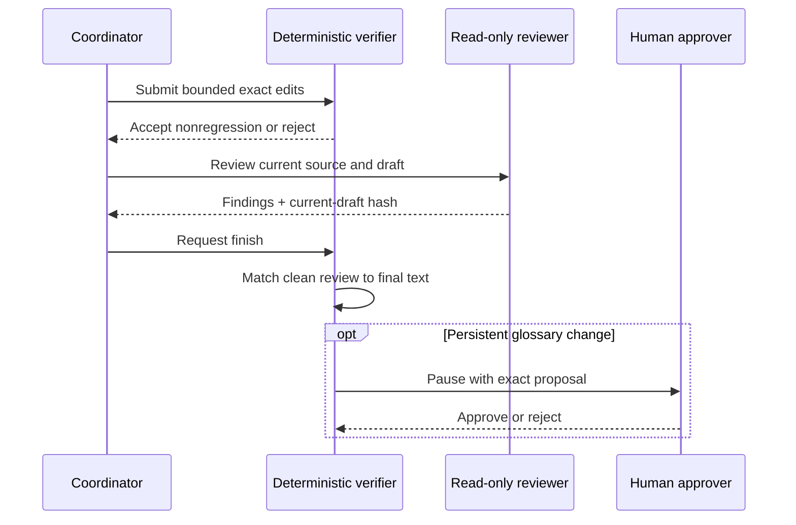

# Agentic Translation Reliability Harness


[](https://github.com/MrEricL/public-tl-harness/actions/workflows/harness-v3.yml)

[](LICENSE)

This is a source-grounded agent harness for repairing translated text. A
coordinator proposes bounded edits, deterministic QA rejects regressions, and
an independent read-only reviewer must clear the exact final draft before an
automatic run can finish.

The repository includes credential-free demonstrations, durable pause/resume,
cache-only replay, approval-gated glossary updates, provider usage receipts,
HTML reports, and the existing batch translation workflow. Automatic repair is
the default for new showcase runs; the earlier specialist, single-agent, and
deterministic strategies remain available explicitly.

## What the harness enforces

- Exact, single-occurrence replacements in atomic bundles; no fuzzy or
  whole-document rewrites.
- Patch and step budgets, typed tool calls, and a trusted tool registry.
- QA-neutral semantic edits only when QA does not regress and no new finding
  identity appears.
- A completed, nonblocking fidelity review whose SHA-256 matches the current
  draft. Any later edit invalidates that review.
- Bounded, read-only terminology and fidelity specialists. Only the coordinator
  can edit text or select and promote terminology.
- Human approval before a selected term reaches the persistent run glossary.
- Resume identity checks for source, glossary, provider, tool contract,
  instructions, patch policy, review policy, and delegation limit.



> The model proposes; the verifier disposes.

## Quickstart: neutral automatic-repair demo

The checked-in demonstration uses only synthetic technical statements about a
controller, a valve, and numeric readings. It intentionally reverses one
operation sequence and leaves one technical term untranslated.

```bash
python -m venv .venv
source .venv/bin/activate
python -m pip install -U pip
python -m pip install -e '.[dev]'
```

Run the offline fixture. No API key or network call is required:

```bash
python -m agentic_translation harness run \
  --story samples/synthetic_repair_demo/story.yaml \
  --out runs/synthetic-repair
```

The first pass repairs operation order, normalizes punctuation, chooses a
stable translation for the technical term, obtains a fresh fidelity review,
and pauses before the persistent glossary write. Inspect
`runs/synthetic-repair/report.html`, then approve and resume:

```bash
python -m agentic_translation harness resume runs/synthetic-repair \
  --approve --reviewer demo
```

The second synthetic statement then reuses the approved term. Replay every
recorded provider decision into a fresh directory without a network call:

```bash
python -m agentic_translation harness replay runs/synthetic-repair \
  --out runs/synthetic-repair-replay
```

For a one-command demonstration, add `--auto-approve`. The fixture is scripted
contract evidence, not a model-quality measurement.

## Existing Harness v3 demonstrations

The original golden control loop remains available:

```bash
python -m agentic_translation harness golden \
  --runs-dir runs --pause-for-approval --overwrite

python -m agentic_translation harness resume \
  runs/agentic_harness_v3_demo --approve \
  --reviewer demo-reviewer \
  --note "Approve the reviewed run-local glossary promotion."
```

The deterministic transport and exposure bench also remains available:

```bash
python -m agentic_translation harness bench \
  --suite samples/harness_eval/v3_cases.json \
  --out runs/harness-eval --overwrite
```

The earlier cache-only terminology replay still demonstrates two-model term
proposals, blinded selection, QA-gated repair, and deterministic replay. See
[USER_GUIDE.md](USER_GUIDE.md) and [DEMO_SCRIPT.md](DEMO_SCRIPT.md).

## Live OpenAI-compatible providers

Supply credentials through environment variables or `--env-file`; never place
keys in story files, caches, reports, or commits.

```bash
python -m agentic_translation harness run \
  --story samples/synthetic_repair_demo/story.yaml \
  --out runs/live-repair \
  --provider-mode live --profile openai --model your-model
```

The tested DeepSeek V4 Flash profile uses strict JSON actions, thinking
disabled, temperature `0`, and `2048` output tokens:

```bash
python -m agentic_translation harness run \
  --story samples/synthetic_repair_demo/story.yaml \
  --out runs/deepseek-repair \
  --provider-mode live --profile deepseek --model deepseek-v4-flash
```

Those settings are a tested profile, not a claim of universal model support.
The action validator accepts the provider's supported flat or nested JSON
shape and rejects mixed or ambiguous forms. Usage receipts retain available
input, output, cached-input token counts, and latency while keeping secrets out
of saved configuration.

## Architecture

| Layer | Responsibility |
| --- | --- |
| Coordinator | Reads bounded context, delegates reviews, selects terms, and proposes edits. |
| Tool registry | Validates exposed actions and keeps provider-facing schemas aligned with runtime behavior. |
| Repair executor | Applies candidate edits to a working copy and rejects no-ops, ambiguity, budget violations, and QA regressions. |
| Specialists | Read source, draft, and glossary through bounded tools; return structured evidence without write access. |
| Session store | Persists events, snapshots, identity, approvals, policy, and provider receipts. |
| Report renderer | Produces an escaped HTML account of edits, reviews, approvals, artifacts, and usage. |

The full batch pipeline remains in place for story configuration, chapter
manifests, review queues, glossary maintenance, replay, proof reports, and
optional TXT/EPUB packaging. Automatic showcase repair is a focused runtime
path, not a replacement for every batch command.

## Evidence and limits

The existing five-chapter paired benchmark and public aggregate results remain
documented under
[experiments/mid_corpus_harness_benchmark](experiments/mid_corpus_harness_benchmark/README.md).
Its encoded rule hits fell from 68 to 0, while blind overall preference favored
the baseline 7–5 with 8 ties. Mechanical cleanup did not establish overall
translation superiority.

Later private functional checks motivated the automatic policy now implemented
here. Across abbreviated checks, ten clear-source meaning cases were corrected;
15 attempts across 14 cases included one initial punctuation failure and one
disclosed successful retry. Fourteen completed attempts carried current-text
reviews, 12 QA-neutral patches were accepted, and one semantic replay matched
text with 8/8 cache hits. These are historical aggregate observations, not
measurements of the new synthetic public fixture or proof of a quality or cost
advantage.

Known limitations remain important:

- A reviewer can still invent an unnecessary gendered pronoun.
- A correctly marked illegible source gap can finish without the expected hold.
- A clean model review is evidence tied to a draft, not proof that the draft is
  correct.
- Specialist context is bounded; long-document coverage is not exhaustive.
- This is a local harness, not an OS sandbox, distributed scheduler, or general
  crash-recovery system.

## Data and generated artifacts

Read [DATA_NOTICE.md](DATA_NOTICE.md) before adding fixtures. The new automatic
demo is explicitly synthetic. No personal story text, private glossary, raw
provider response, or private run artifact is required.

Generated `runs/`, `.agentic_cache/`, session receipts, local environment files,
and credentials should not be committed. Replay caches can contain complete
prompts and text even when no secret is present.

## Documentation

- [Automatic repair contract](docs/AUTOMATIC_REPAIR.md)
- [Session identity and resume guarantees](docs/SESSION_IDENTITY.md)
- [Operator guide](USER_GUIDE.md)
- [Demonstration script](DEMO_SCRIPT.md)
- [Data notice](DATA_NOTICE.md)
- [Changelog](CHANGELOG.md)

## Development

```bash
python -m pip install -e '.[dev]'
python -m pytest -q
```

CI also runs the established benchmark tests plus golden, automatic-demo, and
cache-only replay smoke checks. Python 3.11 or newer is required.
