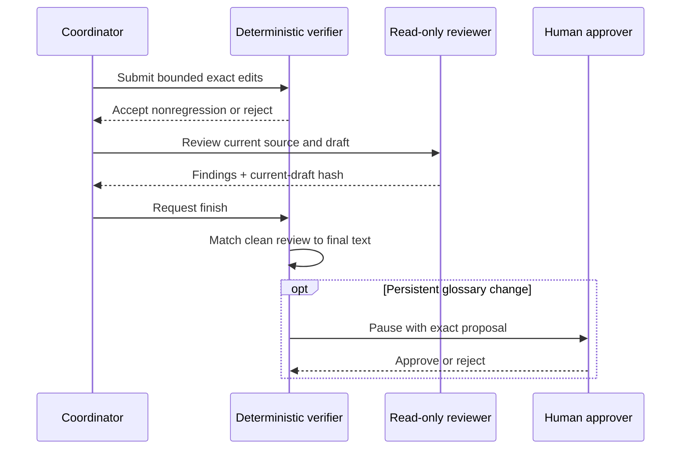

# Agentic Translation Reliability Harness


[](https://github.com/MrEricL/public-tl-harness/actions/workflows/harness-v3.yml)

[](LICENSE)

This is a source-grounded agent harness for translating long Chinese web novels
without letting names and terms drift. Models propose drafts, findings, and
exact edits; trusted code checks every edit, applies it or rejects it, and
records the evidence for replay. Optional Jev semantic checks add a cheap typed
screen.

## 2.7× fewer inconsistent renderings of names and terms across chapters

Translated one chapter at a time, a character called 伊文 came out six different
ways in ten chapters: Irwin, Evan, Ivan, Ewen, Evin, Erwin. With the harness, he
was "Evan" every time.

On a pre-registered test of 40 held-out chapters from four Chinese web novels,
with the same writer model (DeepSeek Flash) in every arm:

| Measure | One chapter at a time | With the harness | Change |
| --- | ---: | ---: | --- |
| Recurring-term appearances (per chapter) with the term's usual rendering | 65.9% | **87.2%** | 2.7× fewer inconsistent renderings |
| Series-glossary renderings matched exactly | 37.0% | **86.0%** | 4.5× fewer glossary misses |
| Recurring terms rendered more than one way | 72.5% | **38.8%** | nearly halved |
| Estimated API cost | $0.002 per chapter | $0.017 per chapter | about $17 per 1,000 chapters at off-peak rates |

- **Statistically significant:** +21.0 points paired per term, with a 95%
  work-cluster bootstrap interval of 16.7 to 25.1.
- **Worst drift mostly removed:** of the 72 recurring terms that
  one-chapter-at-a-time translation rendered three or more ways, the harness
  rendered 39 exactly one way.
- **Scope:** this measures consistency, not overall literary quality. Blind
  judges from two model families found no overall quality gain (14 wins, 9
  ties, 17 losses against naive translation), and story memory plus the
  glossary produce most of the improvement.

Every arm, the judging protocol, costs, and limits are in
[Results](docs/RESULTS.md).

## Contents

- [Try it](#try-it)
- [What makes it a harness](#what-makes-it-a-harness)
- [How repair works](#how-repair-works)
- [Same tools, different harnesses](#same-tools-different-harnesses)
- [What changed after measuring](#what-changed-after-measuring)
- [Optional Jev semantic checks](#optional-jev-semantic-checks)
- [Why I built this](#why-i-built-this)
- [Documentation](#documentation)
- [Development](#development)

## Try it

Python 3.11 or newer is required. Install from the repository root:

```bash
python -m venv .venv
source .venv/bin/activate
python -m pip install -U pip
python -m pip install -e '.[dev]'
```

No API key? Run the offline walkthrough. It uses scripted model decisions to
show translation, repair, an auto-approved glossary change, and TXT/EPUB
delivery; it is not a quality measurement. Replay then reproduces the run
without model calls:

```bash
python demo.py --offline --out runs/offline-demo --open
python -m agentic_translation harness replay runs/offline-demo --out runs/offline-demo-replay
```

Translate your own folder of Chinese chapters with one OpenAI-compatible key.
The script asks for the folder (drag it into the terminal), provider, model ID,
and a hidden key; presets cover OpenAI, Anthropic's compatibility endpoint,
DeepSeek, OpenRouter, and custom endpoints:

```bash
python demo.py
```

The `harness` commands use the `openai` and `deepseek` profiles (other
OpenAI-compatible endpoints via `OPENAI_BASE_URL`); supply credentials through
environment variables or `--env-file`. A live run can record provider
responses to a local cache such as `.agentic_cache` for later replay. The cache
holds prompts, source excerpts, and responses, so it should not be committed.

To see where the gains come from, compare plain translation → glossary prompting
→ source memory → bounded repair on the bundled story:

```bash
python demo.py --provider deepseek --model YOUR_MODEL \
  --source samples/showcase/source \
  --glossary samples/showcase/terms/demo_glossary.json \
  --compare --out runs/my-comparison --open
```

The local report shows category-level gains and regressions, every draft side
by side, exact edits, warnings, model calls, and the delivered book. A second
short test, `--repair-bench`, checks repairs of ten seeded meaning errors and
two clean controls. See the [try-it guide](docs/TRY_IT.md) and the
[two focused tests](experiments/portfolio_demo/README.md).

`demo.py` uses the same building blocks as the measured harness (source
memory, the translator's glossary, batched alignment, and guarded passage
review) without Jev routing. It is not the frozen configuration measured in
Results, whose runner reads the private corpus and is not published.

## What makes it a harness

- **The model proposes; code disposes.** Typed actions and exact edits are
  validated against target text and hashes, then applied as bounded atomic
  patches to a working copy. In the long-horizon pipeline, edits that shrink a
  passage sharply, drop source numbers, add translator glosses, duplicate
  text, or regress QA are rejected.
- **Source-grounded story memory.** A causal memory built only from the Chinese
  source records names, terms, and facts as chapters arrive, with provenance
  for every entry. The translator's glossary takes precedence.
- **Fresh-review gate.** In the interactive `harness run` workflow, a chapter
  completes only after a clean fidelity review whose SHA-256 matches the final
  draft; any later edit invalidates it. The unattended long-horizon path
  instead delivers with recorded warnings when review is unavailable or a
  screen flag stays unresolved.
- **One tool surface for any harness.** The chapter-repair tools are exposed as
  a CLI and a dependency-free MCP stdio server, so this project's loop, Claude
  Code, and Codex drive identical guarded tools.
- **Replayable, resumable runs.** Provider calls, decisions, and checkpoints
  are recorded. Cache-only replay reproduces a run without network calls, and
  persistent glossary changes pause for approval and resume only against a
  matching session.
- **Fail-fast providers.** Each demo call has a total deadline, and a run with
  missing output reports "No score" instead of a misleading delta.

## How repair works

Automatic repair is the default. A coordinator chooses typed actions;
read-only specialists review terminology and fidelity. Python validates each
action, applies edits to a working copy, and checks the result before accepting
it.


```mermaid
sequenceDiagram
    participant C as Coordinator
    participant V as Deterministic verifier
    participant R as Read-only reviewer
    participant H as Human approver
    C->>V: Submit bounded exact edits
    V-->>C: Accept nonregression or reject
    C->>R: Review current source and draft
    R-->>C: Findings + current-draft hash
    C->>V: Request finish
    V->>V: Match clean review to final text
    opt Persistent glossary change
        V->>H: Pause with exact proposal
        H-->>V: Approve or reject
    end
```

| Control | Behavior |
| --- | --- |
| Bounded edits | Exact, single-occurrence replacements in atomic bundles; step and mutation budgets limit the loop. |
| QA gate | A changed draft is accepted only when QA does not regress or introduce a new finding. |
| Guards (long-horizon pipeline and folder demo) | Patches that shrink a passage by more than 30%, drop a number printed in the source, add parenthetical glosses or slash alternatives the source lacks, or copy an existing paragraph are rejected. The harness-lab tools apply the shrink/number check. |
| Final review | Completion requires a nonblocking fidelity review whose SHA-256 matches the current draft. Any edit invalidates the earlier review. |
| Glossary approval | The coordinator proposes persistent terminology changes; a human approves them before the run continues. |
| Resume identity | Source, glossary, provider, tools, instructions, and policies must match the saved session. |
| Replay | Saved provider decisions reproduce the run. Missing or mismatched records fail without falling back to live calls. |

For the long-horizon path, source memory feeds each chapter's draft; a batched
alignment pass and routed review then repair what deterministic checks and
screens find. The [operator guide](USER_GUIDE.md) covers batch workflows,
review queues, and TXT/EPUB packaging, and the
[repair contract](docs/AUTOMATIC_REPAIR.md) states the editing and review rules.

The authored, credential-free repair demo pauses at the approval boundary:

```bash
python -m agentic_translation harness run \
  --story samples/synthetic_repair_demo/story.yaml \
  --out runs/synthetic-repair
python -m agentic_translation harness resume runs/synthetic-repair \
  --approve --reviewer demo
python -m agentic_translation harness replay runs/synthetic-repair \
  --out runs/synthetic-repair-replay
```

## Same tools, different harnesses

The harness lab holds the task and tools fixed and changes the harness. Six
development chapters started from the same draft and the same seven tools:

| Harness | Model | Edits accepted / attempted | Chapters edited | Judged vs starting draft (W / T / L) |
| --- | --- | ---: | ---: | --- |
| This project's loop | DeepSeek Flash | 0 / 0 | 0 / 6 | identical (no edits) |
| Claude Code | Claude Sonnet 5 | 9 / 10 | 5 / 6 | 5 / 1 / 0 |
| Codex | GPT-6 Luna | 16 / 20 | 6 / 6 | 1 / 3 / 2 |

The same guarded tools produced no edits, a few careful edits, or many edits.
Each condition also differs by model and judge, so this shows how harnesses
behave, not a ranking. Point any harness at a task directory created with
`ToolSurface.create_task`:

```bash
python -m agentic_translation.mcp_server --task runs/task       # MCP stdio server
python -m agentic_translation.tools_cli --task runs/task list_segments   # shell-only harnesses
```

The lab runner itself is not included because its tasks come from private
chapters.

## What changed after measuring

- **The strict verifier refused correct repairs.** On 252 short repair trials,
  the first harness delivered 11 of 36 faithful outputs where direct prompting
  delivered 36 of 36. Its verifier accepted an edit only if a rule score
  improved, so it held all twelve semantic-error trials instead of repairing
  them. Accepting QA-neutral meaning repairs with a fresh source review then
  fixed 10 of 10 targeted meaning errors.
- **Classical fiction hid the problem.** A first run on public-domain classics
  barely changed any text, so the evaluation moved to web novels, where names
  and terms are invented and drift is common.
- **Memory and repair could make chapters worse.** Development judges flagged
  glosses inside memory terms, literal names locked in early, and repairs that
  overrode the source. Each became a versioned fix: cleaner memory terms, the
  translator's glossary taking precedence, and guards against glosses and
  duplicated text.
- **Only then was the held-out set run, once,** with the configuration and
  primary outcomes written down first.

## Optional Jev semantic checks

Jev adds source-aware judgments to the repair loop. It answers narrow questions
about missing content, unsupported additions, actor/action roles, negation,
and source ambiguity. The repair model receives typed probabilities alongside
the normal QA findings. Choose five focused questions or eighteen dense
questions; shadow mode records the signals, and advisory mode shares them with
the coordinator.

Jev is off by default. It supplies signals rather than edits, and final
fidelity review still applies. In the unattended workflow it can instead route
passages to review; on the held-out novels its development thresholds routed
62% of passages, so routing did not save money there. See the
[Jev guide](docs/JEV_EXTENSION.md) and its
[aggregate evidence](docs/JEV_EXTENSION.md#aggregate-evidence).

## Why I built this

I've always been a big fan of stories from China, Japan, and Korea, and the
biggest bottleneck was the shortage of translators. There was a huge buffet of
stories, but only a trickle made it into English.

LLMs made most chapters readable, and the issue became long-term coherence. Web
novels run for hundreds of chapters, beyond what a context window can hold.
This is a big issue in fantasy stories, where names carry worldbuilding: a
technique called **Moon-Shadow Step** might turn into **Lunar Shadow Footwork**,
or the **Azure Cloud Sect** might show up later as the **Blue Cloud School**.
Choosing that language is where a translator has the most influence, so it has
to stay stable.

My goal is to drop in a story and get back an English edition I can read on the
train.

## Documentation

| Read | For |
| --- | --- |
| [Results](docs/RESULTS.md) | Every arm, judging, costs, harness lab, and limits |
| [Try-it guide](docs/TRY_IT.md) | Keys, providers, file formats, limits, and replay |
| [Two focused tests](experiments/portfolio_demo/README.md) | Terminology gains by category and seeded semantic repair |
| [Operator guide](USER_GUIDE.md) | Batch, live, and replay operations |
| [Automatic repair contract](docs/AUTOMATIC_REPAIR.md) | Editing, QA, and review rules |
| [Jev guide](docs/JEV_EXTENSION.md) | Configuration and evaluation |
| [Session identity](docs/SESSION_IDENTITY.md) | Resume guarantees |
| [Demo script](DEMO_SCRIPT.md) | A two-minute walkthrough |
| [Five-chapter benchmark](experiments/mid_corpus_harness_benchmark/README.md) | An earlier paired benchmark |
| [Data notice](DATA_NOTICE.md) | What is and is not distributed |
| [Changelog](CHANGELOG.md) | Release history |

The demos exercise control flow with authored fixtures and scripted model
decisions. A clean model review does not guarantee a correct translation. Keep
credentials, private text, generated `runs/`, and live response caches out of
commits.

## Development

```bash
python -m pip install -e '.[dev]'
python -m pytest -q
```

CI runs the package tests on Python 3.11 and 3.13, the benchmark checks, and
the credential-free demos.
